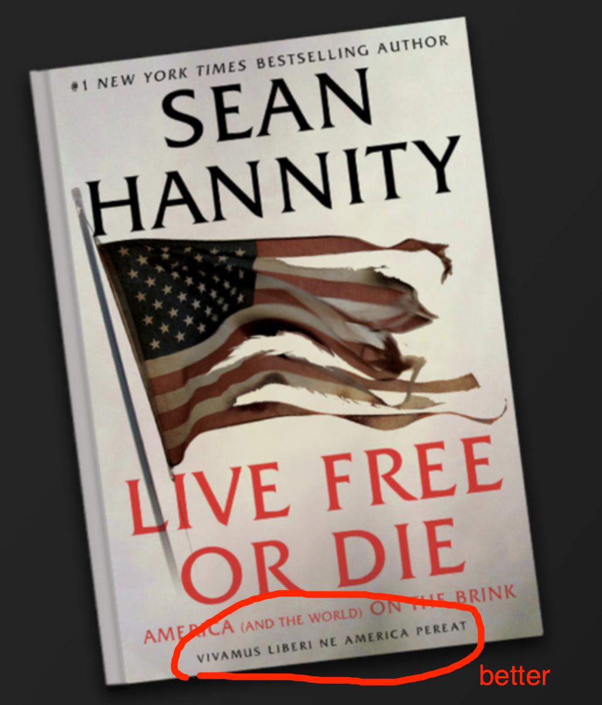
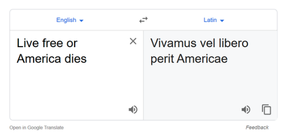

# Greek 101, section 1

# <https://neelsmith.github.io/greek101/>

---

# Agenda

1. Course overview
2. Submit your name in Greek!
3. Read some Greek words together

---

# New curriculum

- no made-up Greek: Lysias, oration 1
- topics ordered so you can read immediately
- CBL component

---

# Real Greek: Lysias 1

- fifth-century BCE murder trial
- textbook keyed to Lysias 1
- two translations in textbook: read through before CBL meeting

---

# Getting the most out of the curriculum

Please do read the syllabus!

Note tips for how to succeed

---

## How grading works

- specification grading
- note calendar for initial due dates and final revisions

---

## Mechanics

- course web site
    - **[home page](https://neelsmith.github.io/latin101/)** has announcements and week at a glance
    - **schedule** has links to daily assignments
    - **search box** (top of every page)  also useful!

--- 

# CBL

- collaboration with WAM and Worcester Public Schools
- weekly meeting with TA

---

## Studying Greek as a form of privilege

-  can convey real, transferable skills:
    - with languages
    - with cultural understanding
- *Money* magazine: [HC #5 liberal arts college](https://news.holycross.edu/blog/2022/08/09/money-magazine-ranks-holy-cross-no-5-among-best-liberal-arts-colleges-in-the-nation/)!    
- but also can be gatekeeper to other privileges/power

---

**Vivamus vel libero perit Americae**

> ?? Let’s live or s/he passes away from America for the detriment of a free man??

([Spencer Alexander McDaniel](https://talesoftimesforgotten.com/2020/05/16/sean-hannity-does-not-know-latin/), Junior Classical Studies/History major at Indiana University, Bloomington, 2020 blog post)

---

**Vivamus liberi ne America pereat**

> Let us live as free people so that America does not perish.

---

# Live free, Google!

---

# Latin: what kind of authority?

Why a Latin motto?

Why not Spanish?  or Chinese?

---

# Practice reading

---

